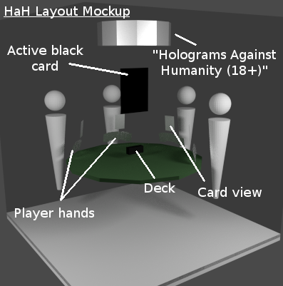

Holograms Against Humanity Use Cases
====================================

Use Case 1: Game Setup
----------------------

Elements involved: *New Game* button, card deck

1. Each "installation" of the game should have some ID token appended to the target URL,
	uniquely identifying the game in play. E.g. `http://nodriftreality.com/HaH.html?gameId=deadb33f`

2. To start a new game, a player clicks on the *New Game* button (perhaps the marquee in the mockup?). 
	This reinitializes the game.

3. Each player then clicks on the deck at the center of the table to join in. They are dealt their full
	hands, and said cards appear on the table in front of them (using the event ray maybe).

	1. Players may join and leave at any point, but the game cannot continue with fewer than four players.

4. When all players have joined, the player that started the new game clicks the button again (changed to
	a *Start Game* button), and play begins.

Use Case 2: Game Play
---------------------

